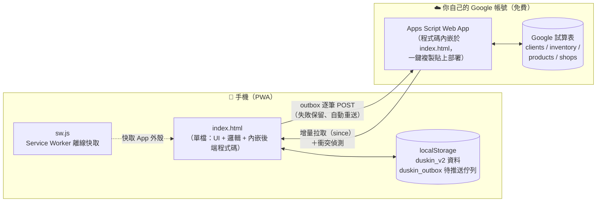

# DUSKIN 銷售系統

[](https://github.com/coookiepan/salesystem/actions/workflows/ci.yml)

> 專為**外勤業務人員**設計的行動網頁應用程式（PWA）。
> 單一 HTML 檔、零建置、零月費——資料存在手機、自動同步到你自己的 Google Sheets。

外勤業務在路上最需要的是：**離線也能用、單手能操作、資料不會丟**。
這套系統把客戶管理、拜訪日誌、待辦、車上庫存、日報、報價單／合約產生全部裝進一個手機網頁裡，部署在免費的 GitHub Pages 上，後端只用你自己的 Google 試算表。

---

## ✨ 功能一覽

| 分頁 | 功能 |
|------|------|
| 👥 **客戶** | 客戶名單＋銷售階段（未拜訪→初訪→試用中→…→已成約）、地圖檢視（Leaflet＋自動定位）、拜訪紀錄、試用品項與 4W 金額試算 |
| 📅 **日報** | 選日期自動彙整當天拜訪、心情、狀態異動 |
| ✅ **待辦** | Todoist 式智慧輸入：「明天回收試用品 #王記餐廳 p1」自動解析日期／客戶／優先級；逾期→今天→即將 分區清單 |
| 🔍 **查詢** | 公司既有客戶名單（shops）與工業區開發名單（prospects）查詢、一鍵建檔 |
| 📦 **庫存** | 車上庫存 ±1、補滿、缺貨清單 |
| ⚙️ **設定** | 商品資料庫、Google Sheets 同步、JSON 備份／還原、診斷紀錄 |
| 📄 **報價／合約** | 分步精靈產出 Word（.docx）報價單與公版 DUSKIN 商品租賃契約書，手機可直接分享 |
| 📊 **長官儀表板** | `?admin=1` 啟用，跨多位業務員試算表的唯讀彙總 |

### 技術特點

- **離線優先**：Service Worker 預快取 App 外殼；資料存 `localStorage`，沒網路照常作業
- **不丟資料的同步**：每筆修改先寫入持久化「待推送佇列（outbox）」，成功才出列；多裝置衝突會明確問你「用我的版本／保留雲端」
- **零成本架構**：前端 GitHub Pages、後端 Google Apps Script＋試算表，全部免費
- **零依賴建置**：沒有 framework、沒有 bundler——`index.html` 打開就能跑

---

## 🚀 快速開始

### 我是使用者（業務員／主管）

照著一步一步的圖文教學設定，不需要任何技術背景：

👉 **[GUIDE.md — 完整設定指南](GUIDE.md)**（Fork → 建試算表 → 部署 Apps Script → 連線）

### 我是開發者

```bash
git clone https://github.com/coookiepan/salesystem.git
cd salesystem

# 本機開啟（任何靜態伺服器皆可；直接雙擊 index.html 也能跑大部分功能）
python3 -m http.server 8000   # → http://localhost:8000

# 跑測試（提交前必須全綠）
cd test && npm install && npm test
```

純函式自我測試：開 `index.html?test=1` 會在 console 與頁面顯示結果。

---

## 🏗 架構總覽



每筆修改的同步流程：**改資料 → 先入列 outbox（持久化）→ 立刻嘗試送出 → 成功才出列**。
沒網路就留在佇列，重開 App 自動補送；雲端版本比較新時跳出衝突對話框讓使用者決定。

技術細節（資料模型、同步協定、index.html 內部地圖、發版流程）：

👉 **[docs/ARCHITECTURE.md — 技術架構文件](docs/ARCHITECTURE.md)**

---

## 📁 Repo 結構

```
salesystem/
├── index.html              ⭐ 整個 App（~7,900 行）：CSS 設計 tokens、六分頁 UI、
│                              資料層、同步引擎、報價/合約產生器、內嵌 Apps Script 後端
├── sw.js                   Service Worker（離線快取策略）
├── manifest.webmanifest    PWA 安裝資訊（名稱、圖示、主題色）
├── icon.svg / logo-mark.svg  App 圖示
│
├── README.md               ← 你在這裡（專案入口）
├── GUIDE.md                使用者設定指南（非技術背景可讀）
├── CHANGELOG.md            版本更新紀錄（白話、給使用者）
├── CLAUDE.md               開發慣例（版本號規則、發版三件事、測試要求）
│
├── docs/
│   └── ARCHITECTURE.md     技術架構：資料模型、同步協定、程式區段地圖
│
├── test/                   測試（Node + JSDOM，免瀏覽器）
│   ├── README.md           各測試層說明
│   └── *.test.js           語法/XSS/同步/outbox/待辦解析/a11y/PWA…
│
├── design-system/          設計系統（tokens、元件預覽、UI kit）— 供設計工具使用
└── .github/workflows/      CI：每次 push / PR 自動跑全套測試
```

### 為什麼是單一 HTML 檔？

刻意的取捨：使用者是非技術背景的業務團隊，**部署＝把檔案放上 GitHub Pages**，更新＝重新整理頁面。沒有 build 環節就沒有 build 失敗；單檔也讓 Service Worker 的快取與版本檢查極其簡單（比對一行 `APP_VERSION` 字串）。代價是檔案較大，因此程式內部用明確的區段橫幅（`═══`）維持導覽性，詳見 [ARCHITECTURE.md](docs/ARCHITECTURE.md)。

---

## 🧪 測試與品質

```bash
cd test && npm test
```

| 層級 | 內容 |
|------|------|
| 語法守門 | 解析 inline script、內嵌 Apps Script、sw.js，擋語法錯誤 |
| 安全 | XSS 跳脫掃描（未經 `escHtml` 的欄位直出 HTML 會擋下） |
| 資料層 | outbox 持久化／重送、增量同步合併、衝突流程（JSDOM 全 App 載入實測） |
| 功能 | 待辦自然語言解析 29 案例、欄位驗證、錯誤紀錄 |
| 體驗 | 無障礙輕量守門（lang／alt／icon 按鈕標籤）、PWA 離線（SW 快取行為） |

CI（GitHub Actions）在每次 push 與 PR 自動執行全套測試。

---

## 🔢 版本與發版

版本格式 `vYYYY.MM.DD-xN`（如 `v2026.06.10-m4`），App 內「設定 → 版本資訊」可查看，線上有新版會自動提示。

每次有實質改動，**三個地方一起改**（詳見 [CLAUDE.md](CLAUDE.md)）：
1. `index.html` 的 `APP_VERSION`
2. `sw.js` 的 `CACHE` 版本（確保使用者拿到新外殼）
3. `CHANGELOG.md` 最上方新增白話說明

---

## 🔗 相關連結

- 📖 [使用者設定指南（GUIDE.md）](GUIDE.md)
- 🏗 [技術架構（docs/ARCHITECTURE.md）](docs/ARCHITECTURE.md)
- 📣 [版本更新紀錄（CHANGELOG.md）](CHANGELOG.md)
- 🎨 [設計系統（design-system/）](design-system/README.md)
- 🐛 [回報問題（Issues）](https://github.com/coookiepan/salesystem/issues)
