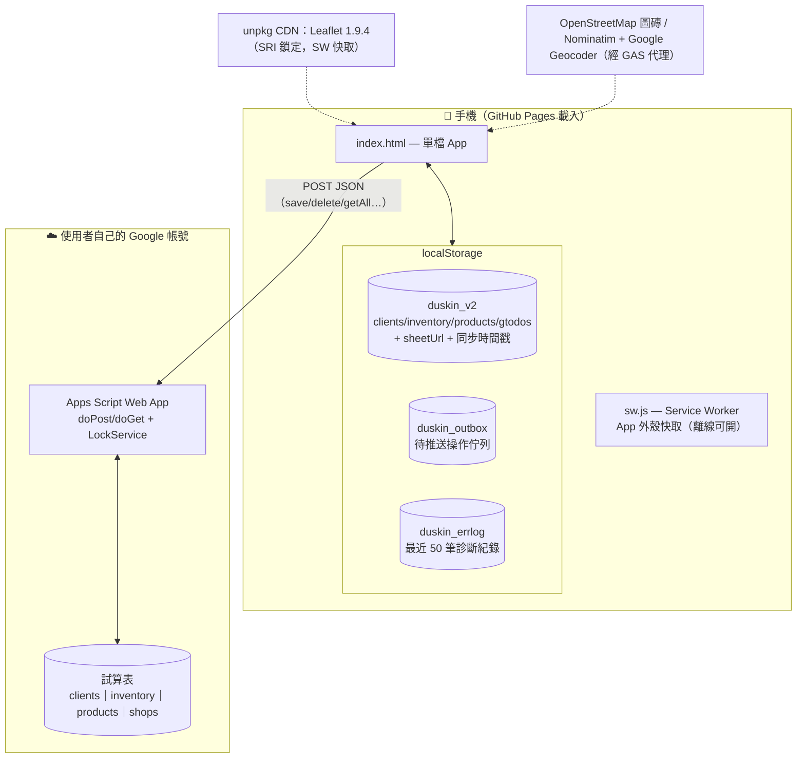
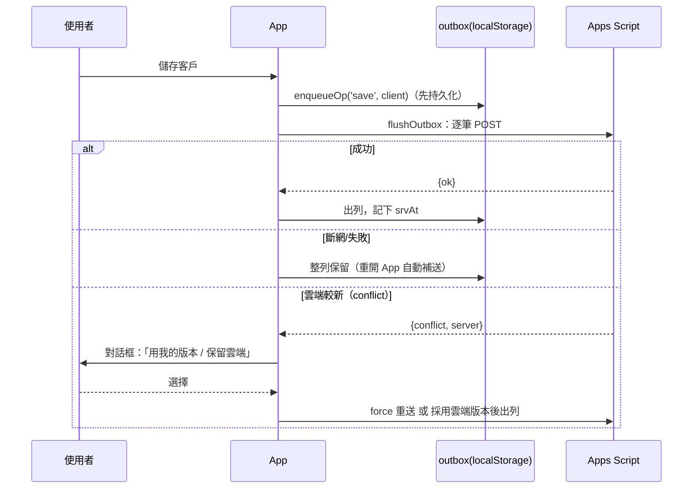

# 技術架構

> 給開發者／維護者的深入文件。使用者請看 [GUIDE.md](../GUIDE.md)；開發慣例請看 [CLAUDE.md](../CLAUDE.md)。

## 目錄

1. [設計理念](#設計理念)
2. [系統組成](#系統組成)
3. [index.html 內部地圖](#indexhtml-內部地圖)
4. [資料模型](#資料模型)
5. [同步機制（outbox／增量／衝突）](#同步機制)
6. [後端：內嵌 Apps Script](#後端內嵌-apps-script)
7. [PWA 與快取策略](#pwa-與快取策略)
8. [UI 系統](#ui-系統)
9. [測試架構](#測試架構)
10. [發版流程](#發版流程)

---

## 設計理念

三個前提決定了所有架構選擇：

1. **使用者非技術背景**——部署、更新、備份都必須「照著做就會」。
2. **外勤情境**——隧道裡、地下室、收訊差的工業區，App 必須離線完整可用。
3. **零預算**——不租伺服器、不買資料庫。

因此：

| 選擇 | 原因 |
|------|------|
| 單一 `index.html`（無框架、無 build） | 部署＝上傳一個檔案；更新檢查＝比對一行 `APP_VERSION` 字串；永遠不會「build 壞了」 |
| `localStorage` 為主資料庫 | 離線完整讀寫；容量對單一業務員的客戶量綽綽有餘 |
| Google Sheets 當雲端後端 | 免費、使用者看得懂自己的資料、主管能直接開試算表看 |
| Apps Script 程式碼**內嵌在前端** | 使用者「複製 → 貼上 → 部署」即完成後端，不用碰 git |
| outbox 待推送佇列 | 收訊差時的寫入絕不能默默消失 |

---

## 系統組成



---

## index.html 內部地圖

整個 App 約 7,900 行，依序分為四大塊。每個區段都有 `═══` 橫幅註解，可用搜尋直接跳轉：

```
index.html
├─ <style>（~25–530 行）
│   DESIGN TOKENS（CSS 變數：品牌色/語意色/狀態徽章色票，含深色模式覆寫）
│   BASE / FORM CONTROLS / BUTTONS / CARD / BADGE / TODO / MOOD / PILL
│   ALERT / TABLE / MODAL / APP TOAST·DIALOG / TODO QUICK-ADD / NAVIGATION
│   MAP / CONTRACT-MAKER（cm-*）
│
├─ <body>（~530–1410 行）
│   六個 .panel（clients/daily/todos/shops/inventory/settings）
│   ＋共用 modal（狀態篩選、商品、庫存、待辦、版本選單、dedup、admin）
│   ＋報價精靈（#cm-modal）與合約精靈（#cm-wiz）全頁 overlay
│
└─ <script>（~1410–7900 行，單一 script，搜尋「═══」橫幅導覽）
    APPS SCRIPT CODE      內嵌後端原始碼（字串常數，供一鍵複製部署）
    預設商品資料           DEFAULT_PRODUCTS / INV_INIT / BUNDLE_MAP 配件規則
    STATE & PERSISTENCE   STATUS 常數、DB、saveLocal/loadLocal、錯誤紀錄、outbox
    SYNC                  api()/autoSync()/flushOutbox()/syncFromSheet()/衝突處理
    NAV                   navTo() 分頁切換
    PRODUCTS PANEL        商品資料庫 CRUD
    MIGRATION             啟動時資料不變式檢查與自動修正
    DEDUP                 重複店家掃描／合併（含雲端清理）
    全域 UI               showToast / appAlert / appConfirm / 全域 Esc 關 modal
    SHOPS / PROSPECTS     查詢頁（既有客戶＋工業區名單，一鍵建檔）
    CLIENT LIST / MAP     列表（分頁渲染）與 Leaflet 地圖（geocode 佇列）
    CLIENT FORM / DETAIL  建檔表單精靈、詳情頁（拜訪/品項/待辦）
    DAILY / REPORT        日報與 4W 推進表產生器
    GLOBAL TODOS          Todoist 式：parseQuickTodo 解析器＋分區清單
    EXPORT / VERSION      JSON 備份、版本檢查（輪詢線上 APP_VERSION）
    ADMIN DASHBOARD       ?admin=1 長官唯讀彙總
    INIT                  啟動序：載資料→migration→render→自動同步
    CONTRACTMAKER 模組    報價單/合約 .docx 產生器（IIFE 模組，docx 套件 CDN 懶載入）
    TEST MODE             ?test=1 純函式自我測試
```

---

## 資料模型

所有資料以 JSON 形式存於 `localStorage.duskin_v2`，結構如下：

```js
{
  clients: [Client], inventory: [Item], products: [Product], gtodos: [Todo],
  profile, profileAcked,            // 業務個人資料（僅本機）
  sheetUrl, prospectsUrl, lastSyncAt, lastPullAt, pending
}
```

### Profile（業務個人資料，僅本機・不上雲）

```js
profile: { office, dept, contact, mobile, phone, fax, email, address,
           salesId, title, seal }
//  salesId 業務編號、title 職稱、seal 電子簽名/印章圖檔（data URL）—皆選填，印在合約乙方欄
```

報價單／合約上「承辦人（乙方）」的唯一資料來源。各業務各自獨立部署（自己的 Sheet＋localStorage），
故 profile 只存本機、不參與雲端同步，但含於 JSON 匯出／匯入。`profile=null` 時 `getProfile()`
回退 `DEFAULT_PROFILE`（潘秉均／台南營業所），潘本人升級無需重填。

- **單一出入口**：`getProfile()` 合併 `DB.profile` 與 `DEFAULT_PROFILE`；ContractMaker 模組透過注入的
  `HOST.getProfile()` 取用（`CM_builder.companyInfo` 與 `cmCompany()` 皆即時讀取，不再寫死）。
- **首次引導**：`profileNeedsSetup()`（承辦人＋手機仍為預設且 `profileAcked=false`）為真時，
  進入報價單／合約前 `ensureDocAuthor()` 跳一次確認，引導去設定頁填寫；填寫或選「就用預設」後設 `profileAcked`，不再每次提醒。
- **印章圖檔**：`seal` 為 data URL，合約 `ctSigners()` 以 docx `ImageRun` 內嵌於乙方欄（`cmDataUrlToBytes()` 轉 Uint8Array；壞圖 try/catch 跳過，不擋合約產生）。
- **上手檢查清單**（設定頁 `renderOnboardChecklist()`）：個人資料／雲端連線／試算表命名三步狀態。
  第三步靠 `refreshSheetIdentity()` 呼叫自己 Sheet 的 `getSnapshot` 取回試算表檔名，與 `profile.contact` 比對——
  因為**主管儀表板（`?admin=1`）以試算表檔名辨識業務員**（後端 `getSnapshot()` 回 `ss.getName()`），
  兩者不一致會在彙總顯示錯誤姓名，故在此提醒對齊。

### 多業務模式（路線 A：各自獨立部署）

擴大給多位業務時採「**單一共用部署 + 各自雲端**」：所有人開同一份 GitHub Pages，各自設定自己的 Sheet URL
與 profile，資料天然隔離。主管彙總（`?admin=1` 長官儀表板）貼多個 Sheet URL 並行抓 `getSnapshot` 合併。
**勿各自 fork**（會造成版本分裂、`checkForUpdate` 各看各的）。離職交接靠轉移 Sheet 擁有權或 JSON 匯出（資料在各自 Google 帳號）。

### Client（客戶，同步雲端 clients 分頁）

```js
{
  id,                    // UUID（crypto.randomUUID，雲端 upsert 的 key）
  name, addr, type, status,        // status ∈ STATUS 常數表（未拜訪…拒絕）
  contact, phone, regNo,           // regNo＝統一編號（工業區名單身分鍵）
  nextdate, trialDate, env, note,
  lat, lng, geocodeSource,         // 地圖定位（manual / geocode_ok / failed）
  trialItems:      [{product, qty, cycle, quoted, bundledTo?, bundleRole?}],
  contractedItems: [{…同上, contractDate}],
  visits: [{date, mood(1-4), note, insight, statusChange, nextdate}],
  todos:  [Todo],
  updatedAt,             // 本機最後修改（衝突偵測比對值）
  srvAt                  // 雲端已確認版本的時間戳（同步基準）
}
```

### Todo（待辦）

```js
{ text, dueDate:'YYYY-MM-DD'|'', done, priority?:1|2|3 }
```

掛在客戶下的 todo 隨客戶同步雲端；**未掛客戶**的存 `DB.gtodos`（僅本機，含於 JSON 匯出）。

### Product／Inventory

```js
Product: { code, cat:'拖把'|'地墊'|'芳香', desc, price, cycle:'2W'|'4W', note, active }
Item:    { name(=product code), stock, std(標準配備數), cat }
```

`BUNDLE_MAP` 定義主商品自動附帶的免費配件（如 S-20 → SHB 拖把頭）與芳香機口味選擇規則。

### 金額算法（唯一入口 `displayFw4`）

更換週期 1/2/4 週 → 每 4 週更換 4/2/1 次；**4W 金額＝契約單價 × 次數 × 數量**；遺失賠償費單價＝每件 4W 金額 × 5。

---

## 同步機制

### Outbox：寫入永不丟失



要點：

- **同 key 收斂**：同一客戶連續修改只保留最新一筆 op，避免重複送
- **嚴格 FIFO**：佇列頭失敗就整體暫停，保證順序性（delete 不會跑到 save 前面）
- **拉取防護**：`syncFromSheet` 前先 flush；若還有未上傳修改則拒絕拉取，避免被雲端覆蓋

### 增量拉取（M2）

本機資料「乾淨」（每筆有 id）且非首次拉取時，帶 `since=lastPullAt` 只拉有更動的列；回傳同時附完整 id 清單，用於偵測雲端已刪除的列。任何不乾淨狀態自動退回整碗拉取。

### 衝突偵測（M3）

每次 save 帶上 `client.srvAt`（上次雲端確認的版本）；後端比對該列現有 `updatedAt`，較新則回 `{conflict, server}` 不寫入。兩種解法（覆蓋／放棄）都會讓佇列前進，不會卡死或靜默覆蓋。

---

## 後端：內嵌 Apps Script

後端原始碼以字串常數 `APPS_SCRIPT_CODE` 內嵌在 index.html（設定頁「複製 Apps Script 程式碼」按鈕的來源），語法由測試層獨立驗證。

| Action | 功能 |
|--------|------|
| `ping` | 連線測試 |
| `getAll` (`since?`) | 全量或增量拉取 clients（逐列容錯：壞 JSON 列跳過並回報列號） |
| `save` (`client`, `force?`) | upsert 單筆＋衝突偵測；`LockService` 20 秒鎖防並行寫入互蓋 |
| `delete` / `deleteByName` | 刪除（後者供 dedup 清理雲端同名列） |
| `saveInventory` / `getInventory` | 庫存整包讀寫 |
| `saveProducts` / `getProducts` | 商品整包讀寫 |
| `getShops` | 查詢頁的公司既有客戶名單 |
| `geocode` | Google Geocoder 代理（地圖定位主來源，免金鑰；失敗退 Nominatim） |

> ⚠ 後端程式碼變動屬「需要使用者重新部署」的更新——CHANGELOG 必須標註，並附 GUIDE.md 的重新部署步驟連結。

---

## PWA 與快取策略

`sw.js`（策略註解在檔頭）：

| 資源 | 策略 | 原因 |
|------|------|------|
| HTML 文件 | **網路優先**，離線退快取 | 上線一定拿到最新程式 |
| 同網域靜態資源 | 快取優先 | 外殼秒開 |
| Leaflet CDN（unpkg，SRI 鎖版本） | 快取優先 | 離線也能載入地圖程式庫 |
| Apps Script POST、地圖磚 | **完全不攔** | 寫入不可重播快取；圖磚本質需連線 |

版本更新雙保險：
1. `sw.js` 的 `CACHE = 'duskin-shell-vN'` 每次發版 +1 → activate 時清舊快取
2. App 內 `checkForUpdate()` 輪詢線上 index.html 的 `APP_VERSION` 行，發現新版顯示更新橫幅

---

## UI 系統

- **設計 tokens**：所有顏色/字級/圓角/陰影都是 `:root` CSS 變數，深色模式以 `prefers-color-scheme` 覆寫同名變數——**JS 產生的 HTML 也必須引用變數**，不可寫死 hex（測試會抓部分情況，review 時留意）
- **狀態色票**：`SS_STYLE`／`CB_STYLE` 以 `var(--ss-*)` 引用，雙色票（淺/深）定義在 tokens 區
- **對話框**：原生 `alert/confirm` 已全面棄用，改用 `appAlert()`／`appConfirm()`（Promise-based、Esc/背景可關、danger 紅鈕）與非阻斷 `showToast()`；測試 stub 時覆寫 `w.appConfirm` 即可
- **設計系統**：[design-system/](../design-system/README.md) 內有 tokens 文件、元件預覽 HTML 與可瀏覽的 UI kit，供設計工具或重建畫面時參照

---

## 測試架構

`cd test && npm test`——Node + JSDOM，**把整個 index.html 真實載入後操作全域函式**，不需要瀏覽器。各檔案職責見 [test/README.md](../test/README.md)。

設計原則：

- **守門優先**：語法、XSS、a11y、PWA 是「永遠不准退步」的底線，跑得快、放最前面
- **資料層全真**：outbox／同步／衝突用 JSDOM 全 App 實測，不 mock 內部函式，只 stub `fetch` 與 `appConfirm`
- **純函式抽測**：如 `parseQuickTodo(text, baseDate)` 接受基準日參數，測試可重現

---

## 發版流程

1. 開發、自測，`cd test && npm test` 全綠
2. **三處同步改版本**（缺一不可，詳見 [CLAUDE.md](../CLAUDE.md)）：
   - `index.html`：`const APP_VERSION='vYYYY.MM.DD-xN';`（此行格式不可破壞，線上版本檢查靠 regex 比對）
   - `sw.js`：`CACHE = 'duskin-shell-vN'` +1
   - `CHANGELOG.md`：最上方新增白話說明（使用者視角）
3. PR → CI 全綠 → merge → GitHub Pages 自動部署
4. 若動到 `APPS_SCRIPT_CODE`：CHANGELOG 標註「需重新部署後端」並附操作連結
